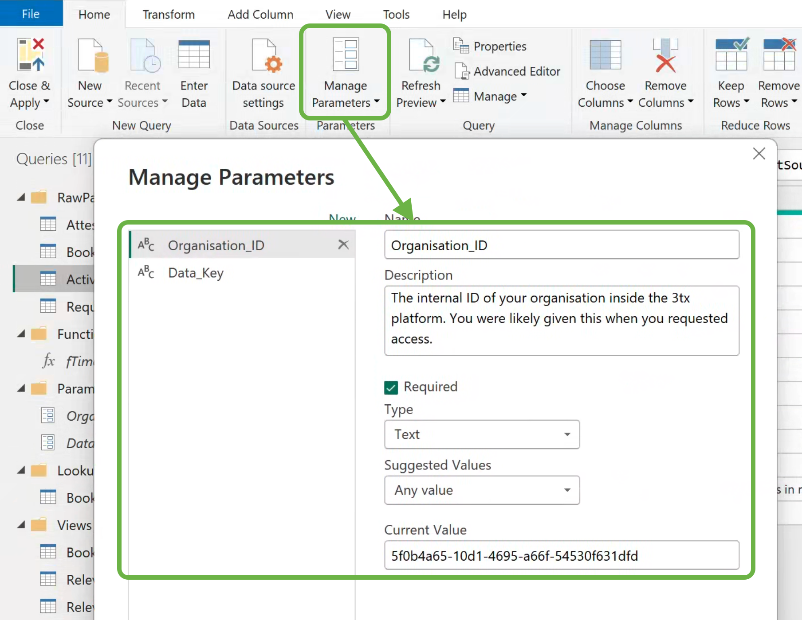

# 📊 3tx PowerBI Example

An example Power BI `.pbix` file that connects to the 3tx platform and fetches data for you to perform analysis upon. It is expected that a technical person who is more familiar with Power BI prepares a dashboard for the intended audience since some setup is required.

🚀 Please be aware that this is currently an example, and is designed to showcase using the 3tx integration for Power BI. You will need knowledge of Power BI to make full use of this.

## What is 3tx?

> Real-Time Insights for Enhanced Training, Competence, and Learning Management

3tx is a competency and compliance platform provided by 3t Digital. If you want world-class workforce training management, come to us. We can help.

https://www.3tglobal.com/digital/

## 👏 Getting Started

1. You will need to contact us for your data key. One will be generated and sent to you.
2. You will need to enter the `Manage Parameters` section inside the example `.pbix` and type in your `data key` and `organisation id`.
3. Refresh all your data sources. It is likely that they will refresh on their own.

The example file contains some simple metrics to get started, but they are by no means useful and it is suggested you delete them and use the data for your own needs.

# Advanced Tools

We provide two scripts, one for Windows and one for Mac/Linux

- `download-data.ps1` - Windows powershell
- `download-data.sh` - Mac/Linux

For Mac and Linux you will also need `jq` installed.

These scripts pull down all your `workforce`, `bookings`, `attestations`, `requirements`, `activities` parquet files so you can run data analysis on them locally.

Please see the files themselves for the parameters.

# About the Data

There are 5 facets to the data, each of which represents the current state of competency and compliance in your organisation.

- `workforce` - This provides the ability to slice your data by `groups`
- `bookings` - This allows you to know which gaps will be filled by training in the future
- `attestations` - This is a lost of proof that people have competed an activity
- `requirements` - This is a list of activities people need within a `group`
- `activities` - This is a list of possible activities

Note that some of the data has been denormalised to simplify queries, for example, a `bookings` record will have an `activity` ID but will also contain the name of the `activity`, so you don't have to consult that table.